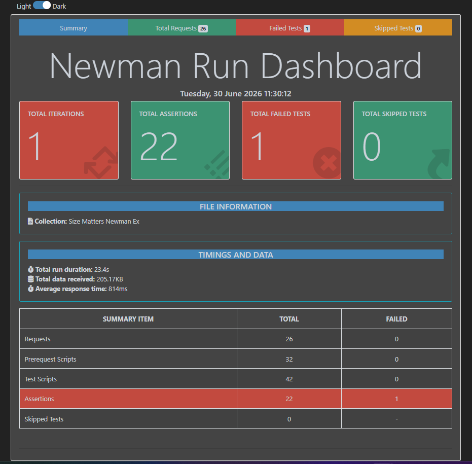

# 🧪 Pet Care API Test Automation

Automated API testing project using **Postman** and **Newman** to validate the core API workflows of the Pet Care application.

---

## 📌 Overview

This project validates the core API workflows through automated test scripts.

### Test Coverage

- API endpoint validation
- Request validation
- Response validation
- HTTP status code verification
- Business logic validation
- JSON schema validation
- Response time validation
- Environment variable handling
- Chained API execution

---

## 🛠 Tech Stack

- Postman
- Newman
- JavaScript (Postman Test Scripts)
- HTML Extra Reporter

---

## 🚀 Run the Collection

```bash
newman run Pet_Care_Newman_Ex.postman_collection.json \
--env-var base=<BASE_URL> \
-r cli,htmlextra \
--reporter-htmlextra-export Reports/PetCare_API_Report.html
```

---

## 📊 Test Summary

| Metric | Result |
|---------|--------|
| Total Requests | 26 |
| Total Assertions | 22 |
| Failed Tests | 1 |
| Skipped Tests | 0 |
| Average Response Time | 753 ms |
| Total Run Duration | 21.8 s |

---

## 📁 Project Structure

```text
pet-care-api-test-automation/
│
├── Collection/
│   └── Pet_Care_Newman_Ex.postman_collection.json
│
├── Reports/
│   └── PetCare_API_Report.html
│
├── Screenshots/
│   └── Newman_Run_Dashboard.png
│
└── README.md
```

---

## ✅ Validations Performed

- HTTP status code assertions
- Response body validation
- JSON schema validation
- Business logic verification
- Data integrity checks
- Environment variable storage
- API chaining
- Negative scenario validation
- Response time assertions

---

## 📷 Newman HTML Report

The project generates an HTML report after execution.


